---

加利福尼亚大学洛杉矶分校公开课，[社会心理学](http://open.163.com/special/opencourse/socialpsychology.html)学习笔记。

（working...）

<!--more-->

## 课程介绍

### 假设1. 情景对人的影响很大

人的想法、行为，受所处`情景`影响。情景不可视，每个人的情景不同。

### 假设2. 我们总是不知道，人做某事的原因

归因错误，而我们也不知道自己为什么要做某事。

### 假设3. 我们从本质上不知道我们不知道

我们使用偏见，无意识地快速抉择，难以察觉。

甚至对自己的看法，也是在数秒内，临时构建出的。

### 假设4. 令人惊讶的是，我们精确地知道人们做事情的原因和他们是哪种人

人的两个社会基本需求：人们想要被别人喜欢、有归属的需要；人们想要准确、一致、可信，想要在别人和自己的眼里始终如一。

## 情境评价和朴素实在论

三个术语

情景：暗示或假定的物理环境、社会环境，也就是你觉得将要发生的事

### 情景的力量

囚徒困境题目，被称作“社区游戏”和“华尔街游戏”时，前者明显更使人倾向选择“合作”，而后者更使人倾向“叛变”。

里根总统的辩论中，风趣的辩论使现场充满笑声。技术手段除去现场观众的声音，把它和原视频播放给两波人，发现现场观众的声音会影响观看录像的人对里根的评价。

### 我们无法预测自己的行为

每个人都认为自己是理性的，会把自己的行为作为准则——就像开在高速路上的汽车，比自己慢的都是傻子，比自己快的都是疯子，但自己的速度并不可能恒定；同理，我们认为别人会不会做某事，都会以自己为标准（`相信`自己会不会做某事）。

### 滑坡效应

电击实验：实验者被要求，学生每犯一次错时增加15V电击，从15V-450V，播放不同程度惨叫的录音，300V后不会发出声音（装昏厥）。

旁观者都觉得大多数人会在300v时要求停止，但实际上68%都做到了最后。

原因是：因为每次只增加15V，我们不会认为之前自己做的事是错的（人趋势于对自己认识始终如一），如果255V时认为自己做错了，那就意味着240V时也做错了——我们的底线是浮动的。

### 朴素实在论

不信任主观解释，主观解释能产生多种合理的观点；不相信我和你能产生同一种看法。

### 偏见——敌对媒体效应(视频下一节讲)

中立的新闻文章，在两群敌对人群中的眼里有不同的解读，双方都认为文章反对自己的立场：双方都认为自己是中立的，自己当作标准，这就是偏见。

## 自动性和启动法

我们之所以意识不到主观，是因为它们是自动形成的。

### 优先启动刺激呈现法（Tory Higgins）

设计2个实验，从被实验者视角看起来毫不相干：

1. 把被实验者分为两组，让他们记忆一些词汇，词汇中穿插了一些用来评价一个人的词汇：给一组展示了是褒义词“自信、勇敢”等，另一组则是贬义词“自负、鲁莽”等

2. 阅读一段描述一个人的文段，里面提到他“觉得自己努力做什么都能成功”（自信/自负）、“穿越大西洋”（勇敢/鲁莽）等，要求被实验者评价他

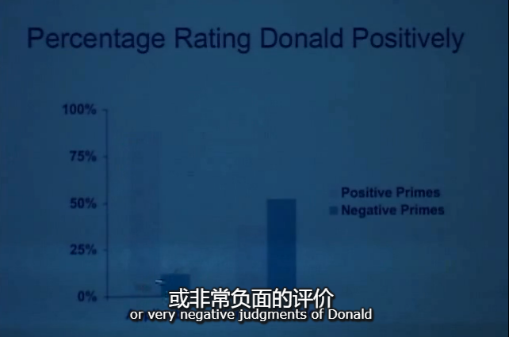

结果是，记忆褒义词的那组，给出了大量正面评价；而记忆了贬义词的那组，大多为负面评价。

另外，如果穿插了“感恩”、“无礼”之类与文段毫无相关的词，就不会影响对他的评价。

我们产生了偏见，且不自觉。

### 阈下启动——警觉实验（Bargh）

把上一个实验简单修改，测试充满“敌意”的启动词对评价的影响。

结果发现“敌意”相关的启动词能影响“敌意”的评价，而无关的词则不会影响。适用于评价特定的性格特征。

### 自动认知负荷

一个实验，要求被试者记（或不记）一串数字，期间给他念关于神父Bob的30个句子：

* 10句关于善意的（合理）
* 10句关于非善意的（不合理）
* 10句无关句子

（我们都知道人们容易记忆不合理的事情）

结果如图：

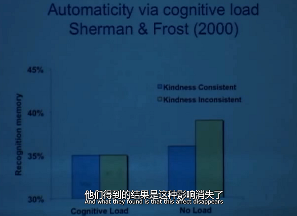

结论：
这种记忆不合理的事情需要认知努力（cognitive effort），承受认知负荷时，“人们容易记忆不合理的事情”这一现象就无法产生，该现象不具备“自动性”。

### 自动性

定义：

* 无意图
* 无需注意
* 不妨碍其他思考过程
* 无需努力

比如一个红色正方形放你眼前，他不会影响到你记忆其他东西。

### 知觉直接性

如果我们经历过的事情是自动性的，它就会立即成为我们经验的一部分。

### 关系网络

联想：

* 男生英语差
* 罗蜜欧&朱丽叶

以上是我们能意识到的，有一种联想在意识（conscious awareness）以下，试想，我们脑内有一个女性名字的数据库，平时要列举女性名字时很难想起“朱丽叶”因为在这个时代并不常见，而提起“罗蜜欧”时这个名字就会自然地跃过这条意识的“线”：

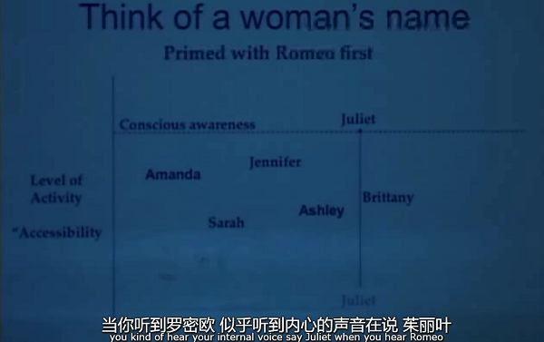

### 习惯可及性

> 可及性理论(accessibility theory) : 通常指一个人在生成和理解语篇时,从大脑记忆 系统中提取一个语言或记忆单位的便捷程度。

一些时在日常中会不断地重复，这些事是习惯可及的，与我们的意识很接近，很容易联想起来，高效地利用它们。

（高速缓存？？）

这些习惯可及性表征，不断地塑造我们的主观性认识，这造成了人之间的差异。

比如酒会上，有人喊你的名字，你比其他人更容易注意到这个名字。（鸡尾酒效应）

比如美国和东亚国家，因为环境差异，人成长过程中获得的信息不同，前者会从外界不断地获得“成为一个独立的人”的意识，而后者倾向于“相互依存，整体融洽”。

### 启动和习惯可及性同时作用

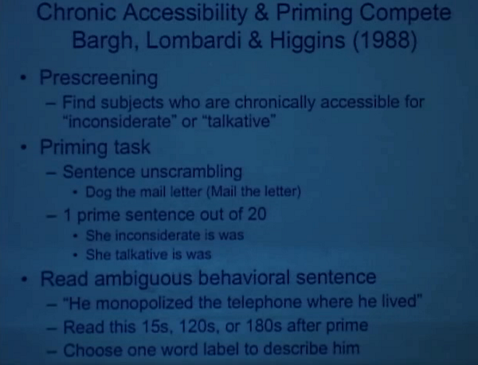

先找出习惯可及为“不顾他人的”人，和“键谈的”人。

让他们参加启动任务“句子删词”，如：Dog the mail letter (Mail the letter)。

共20句子，一半的研究对象会被启动：

* She inconsiderate is was
* She talkative is was

让他们读句子：他总是在走廊打电话。

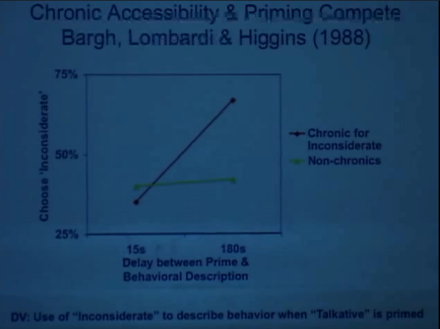

发现启动词在短时间内的效果胜过习惯可及构念。

### 自启动行为

一项实验证明了，自动不仅影响人们对他人的评价，还会影响人们的行为。

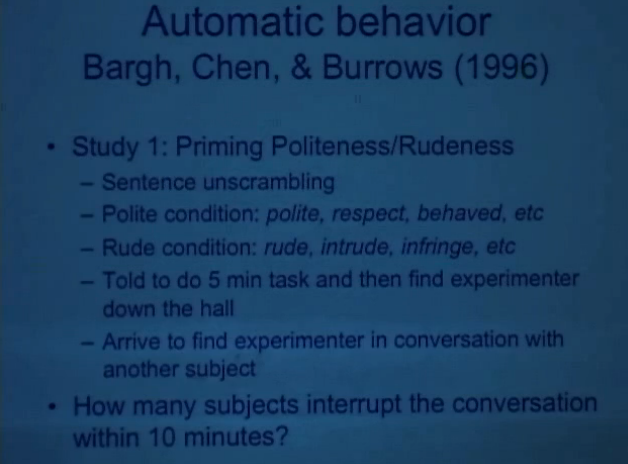

1. 启动词任务：礼貌启动词、普通词、粗鲁启动词
2. 让受试者到另一间房间找研究者，研究者在那跟别人说话
3. 记录有多少人在10分钟内打断了对话

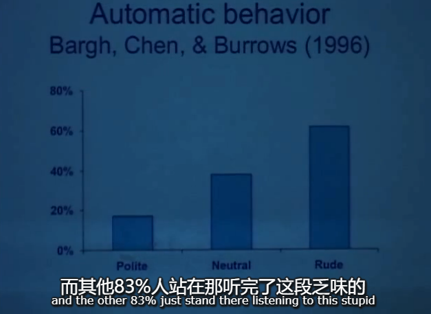

结果是，受礼貌启动词启动的人，只有少部分人在10分钟内打断了对话；而受粗鲁启动词启动的人，打断对话的人要多得多。

### 启动实验

受试者做常识测试，分三组：

* 一组，测试前什么都不做（对照组）
* 二组，被要求想象教授一天的生活
* 三组，被要求想象超级模特一天的生活

结果是二组成绩好，三组成绩差。

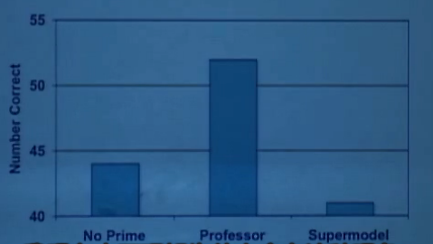

### 自动目标

#### 实验1

读关于一个人的表现的文章。

受试者分两组：

* 一组被要求记忆，后面会测试
* 另一组被要求在之后描述对这个人的印象

后者表现得更好。

#### 实验2

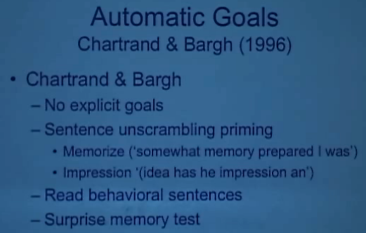

实验一的基础上，使用组句的方式进行“启动”：

* 一组，被启动“记忆”
* 另一足，被启动“印象”

实验结果同实验1.

实验2证明了无论是否有意识地接受目标，并不重要。

P.S.
这里有个被称为“神秘情绪”的东西，如果未能完成目标，事先接受了目标（无论是否有意识地）的受试者，比起未事先接受目标的受试者，心情会更差。

### 一些关于自动性的讨论

#### 自动性从何而来

* 无意识地：如文化感染、婴儿学语言
* 有意识地练习：打字、运动、乐器、学习习惯

#### 它意味着什么

他很重要，能无意识地进行自动关联，影响我们的主观见解，而不需要我们同意。

我们看一些人似乎是在有目标地做一些事，但实际上可能并不是这样，可能是一些自动行为。

## 意识知觉（Conscious Awareness）和控制性加工（Controlled Processing）

### 概念解释

下列两个问题有什么区别：

* Are hamster conscious?
* Can hampsters think?

一般来说，第一句中的conscious指的是表现出有意识的行为；第二句中的think指的是思考过程。

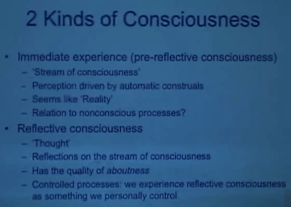

这对应了两种类型的意识：

1. 直接经验（immediate experience），前反思意识（pre-reflective consciousness）指的是无法反思的意识（大概指的是第一个问题中的conscious），：
   * 意识流（Stream of consciousness），一直存在的意识（William James, 1890）
   * 知觉（Perception driven by automatic construals）
   * 现实？（大概在说人类通过感官，所感受到的世界）
   * 与无意识过程（nonconscious processes）有关？（就是之前提到的“自动性”吧，比如当看到一个东西是红色的，我们没法控制自己不认为那是红色）

2. 反思意识（reflective consciousness）（大概就是指第二个问题中的think）：
    * 思考（Thought）
    * 对于“意识流”做出的反应：比如听课的过程，只是单方向地接受信息，直到注意到了奇怪的地方，才开始去思考
    * 相关性（aboutness），指的是我们思考的时候，总是会针对某事物进行思考（about something），而意识流不是针对某事，他本身就是件事情）
    * 控制过程（controlled processes）或控制性加工（controlled Processing）：思考的过程就像由我们个人控制的过程，相对与“无意识过程”

两者的关系，直接经验就像电影，而反思意识就像影评人。

阅读、打字等行为，是两者意识的结合。

### 控制过程（Controlled Processes）

与自动过程相对，以下为它的特性：

* 有意地（intentional）
* 与意识相关
* 会干扰到其他的处理过程
* 需要付出努力
* 趋向语言相关（linguistic）

* 体验上，是种脑力劳动，并不是像“现实”一样，本来就在那里
* 是种特殊而有限的资源，因为人一次只能处理一个控制过程

比如说到“摩托车毯子”，我们不知道是什么，但能想象。

控制过程不一定准确，但我们趋于认为他是准确的，因为它能通过成系统的语言去表达出来，使我们自己信服。例子“电梯逻辑”：一栋楼有6层，搭电梯从1楼上到2楼会被大多数人认为是不合常理的（因为楼梯可能就在旁边），但如果是第一次来这的人可能不知道楼梯的地方，或者脚患有病无法上楼，这就变得合理了。

### 错误共识效应（False Consensus Effect）

问受试者：给你每小时25刀酬劳，你愿意背着“EAT AT BAJA FRESH”的横幅在校园里走吗？

回答愿意的人，趋向于认为别人也愿意；回答不愿意的人，趋向于认为别人也不愿意。

其原因，之前而已探讨过，所处情景不同、以及偏见。

但我们很容易猜出某个人会不会做某件事，只是我们在回答这个问题时，选择错了参考的例子，把特例（比如自己）当成普适。

### 反省思维（Introspective Thinking）

想的和实际的表现不一定相同。比如，被询问到最喜欢的电影是什么，即答xxx，但这有可能是错的，因为如果他再次去看那部电影，可能会得到不一样的结论。

#### 实验Telling more than we can know (Nisbeet & Wilson, 1977)

街边设展台，询问路人喜欢哪种品牌的清洁剂，分两组：

* 其一组，直接询问
* 另一组，先向他们展示“太阳和月亮”这样的词汇

后者趋向于回答“汰渍（Tide）”，而向他们询问给出这个答案的原因时，会说出一些“错误”理由，比如“因为我妈在用”、“因为有名”等等，而真实原因是之前说的“启动性”。

他们不仅被启动词影响，还编造出了原因。

#### 实验Telling Good Art from Bad (Wilson et al, 1993)

向被试者展示两张画：莫奈的画、加菲猫卡通图，要求依据自己喜欢的程度进行评分，分两组：

* 一组没做要求给出评分的理由
* 另一组被要求说出理由

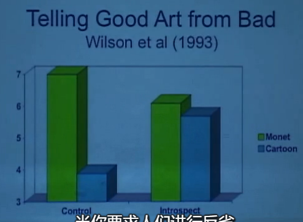

让他们带喜欢的画回家，两周后做回访，问他们现在对手头上的画喜欢的程度，结果选择莫奈的大多称自己仍喜欢，而很多选择卡通的后悔了。

由于莫奈的画比较抽象难以用语言描述，而卡通容易说出理由，导致了人最自己的喜好做出了错误的选择。

