---

> via: https://www.sirogohan.com/recipe/siomusubi/

基础饭团

##  塩むすび（塩おにぎり）の作り方/レシピ

**調理時間：10分以下**

家で作る塩むすび。わが家では土日のお昼など、炊き立てご飯を用意して各自が塩むすびにするなんてことがよくあります。

何気ない普段のご飯だけど、丁寧に作れば、とっても幸せな気持ちにさせてくれるんです！握る前のコツ、塩加減、握り方などを詳しく紹介したいと思います。

## 塩むすびの材料 (作りやすい分量で)

- 炊き立てのごはん　…　適量
- 塩　…　ひとつまみ（詳細は下記に）

- その他用意するもの　…　氷水、清潔なふきん

## 塩むすびの作り方

### 塩むすびの下準備

美味しい塩むすびを作るために必要なものは**『炊き立てのご飯』『塩（あれば自然塩）』『氷水と清潔なふきん』**です。

まず、はじめにお米を炊飯器にセットして、炊き上がったら塩むすびに取り掛かりましょう！

- 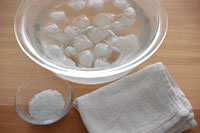
-  

- 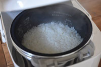

### 塩むすびの手水について

塩むすびの材料は**「ごはんと塩だけ」といたってシンプル**なので、ご飯の美味しさを引き出しつつ、できるだけ味を損なわないようにして作りたいと思います。

まずは前述した**『炊き立てごはんである』**ということ。炊き立てだからこそ、ふっくらと、形よく、しかも美味しい塩むすびになってくれます（炊けたご飯は上下を返してほぐし、軽く蒸気を逃がしてもOK）。

続いて、炊き立てごはんを直に握るのでそのままでは熱くて握れません。なので**『握る前に氷水で手をしっかり冷やしてから、炊き立てごはんを握る』**とよいです。氷水に浸す時間は握る直前に10秒ほどでOKです。

- 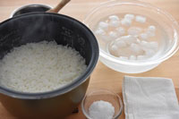
-  

- 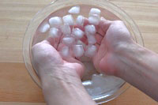

では氷水で冷やした手をどうするかというと、清潔なふきんで水気をある程度ふき取ります。これは**おにぎりを水っぽくしないため**なのですが、炊き立てごはんであれば、手の水気をふき取っても、ごはんが手にくっつかないからでもあります。

- 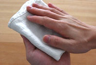
-  

- 

※「水気をある程度ふきとる」というのは、完全に乾いた状態にしないくらいの気持ちです。手に水がたっぷり残った状態で握るのはNGですし、この後塩を手に広げるので、その塩が手になじみやすいくらいの少しの湿気が手に残るくらいがいいと思います。

### 塩むすびの塩加減

水気をふいたら、続いて塩を手に広げます。このとき、**茶碗に軽く1杯のごはんに対して、指3本で塩をつまむ（これでだいたい0.4〜0.5ｇ）くらいの塩加減**でよいと思います。指で取った塩は両手に広げます。

ここで気を付けたいのは、**すぐ食べるときの塩加減はひとつまみでよいですが、冷めてから食べるときは塩気が弱く感じるので、もう少し塩を多めにしてもよいと思います**。塩加減については好みや合わせる料理ともかかわってくるので、適宜調整しながらやってみてください。

- 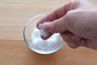
-  

- 

### 塩むすび（おにぎり）の握り方

氷水で冷やした手に、塩を広げ、そこにまだ熱いごはんをのせて握っていきます。**※氷水でしっかり冷やせば、熱いご飯をのせて握っても基本的には大丈夫だと思います。でも熱くて我慢できないときは無理をせずに、まな板や食器に移し、少しだけ粗熱を取ってから握ってみてください※**

握りはじめは、あまり形を気にせずにご飯同士がくっつくようにやさしくまとめ、ご飯がまとまれば、右手を山にしておにぎりの角を作り、左手でおにぎりの底を作る、という気持ちで、転がしながら数回握ります（力を入れすぎないようにしつつ）。

- 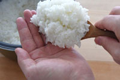
-  

- 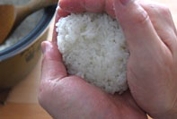
-  

- 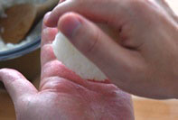
-  

- 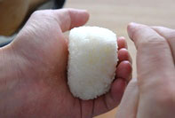

おにぎりがふんわりと握れたら、おにぎりの側面を一度ならして（手の上でおにぎりを横において上下からやさしく手を押し当てて形を整え）、最後にもう一度おにぎりを軽く握って、完成です。

- 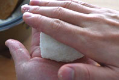
-  

- 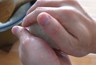
-  

- 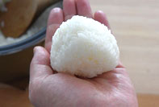
-  

- 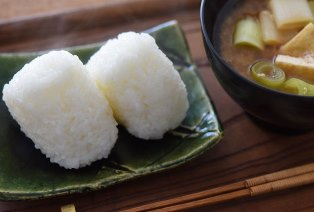

## 補足

 

- 握りたてはまだ湯気が出ている、くらいの仕上がりが最高に美味しく、まさに塩むすびだけでも究極のごちそうに感じられます！
- ただ、やけどしては大変なので、熱いのが苦手な方はごはんの粗熱を少し取ってから握るとよいです。