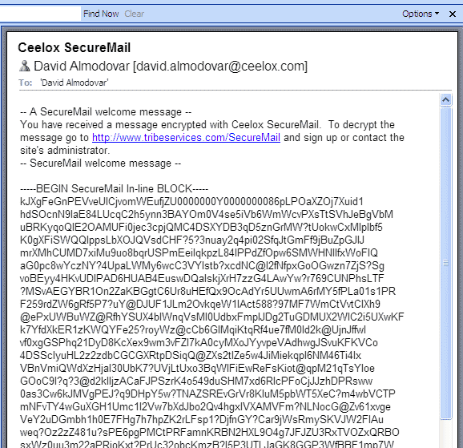

---

```
# 生成密钥
gpg --gen-key

# 罗列密钥
gpg --list-keys

# 导出
gpg --armor --output public-key.txt --export
gpg --armor --output private-key.txt --export-secret-keys 

```


## GPG入门教程

> 作者： [阮一峰](http://www.ruanyifeng.com/)
>
> via：<http://www.ruanyifeng.com/blog/2013/07/gpg.html>

前两篇文章，我介绍了[RSA算法](http://www.ruanyifeng.com/blog/2013/06/rsa_algorithm_part_one.html)。

今天，就接着来看，现实中怎么使用这个算法，对信息加密和解密。这要用到[GnuPG](http://www.gnupg.org/)软件（简称GPG），它是目前最流行、最好用的加密工具之一。

**一、什么是GPG**


要了解什么是GPG，就要先了解[PGP](http://en.wikipedia.org/wiki/Pretty_Good_Privacy)。

1991年，程序员[Phil Zimmermann](http://en.wikipedia.org/wiki/Phil_Zimmermann)为了避开政府监视，开发了加密软件PGP。这个软件非常好用，迅速流传开来，成了许多程序员的必备工具。但是，它是商业软件，不能自由使用。所以，自由软件基金会决定，开发一个PGP的替代品，取名为GnuPG。这就是GPG的由来。

GPG有许多用途，本文主要介绍文件加密。至于邮件的加密，不同的邮件客户端有不同的设置，请参考Ubuntu网站的[介绍](https://help.ubuntu.com/community/GnuPrivacyGuardHowto#Reading_OpenPGP_E-mail)。

本文的使用环境为Linux命令行。如果掌握了命令行，[Windows](http://gpg4win.org/) 或 [Mac OS](https://gpgtools.org/) 客户端，就非常容易掌握。GPG并不难学，学会了它，从此就能轻松传递加密信息。建议读者一步步跟着教程做，对每条命令都自行测试。



**二、安装**

GPG有两种安装方式。可以[下载源码](http://www.gnupg.org/download/index.en.html)，自己编译安装。

> 　　./configure
> 　　make
> 　　make install

也可以安装编译好的二进制包。

> 　　# Debian / Ubuntu 环境
> 　　sudo apt-get install gnupg
>
> 　　# Fedora 环境
> 　　yum install gnupg

安装完成后，键入下面的命令：

> 　　gpg --help

如果屏幕显示GPG的帮助，就表示安装成功。

**三、生成密钥**

安装成功后，使用gen-ken参数生成自己的密钥。

> 　　gpg --gen-key

回车以后，会跳出一大段文字：

> 　　gpg (GnuPG) 1.4.12; Copyright (C) 2012 Free Software Foundation, Inc.
> 　　This is free software: you are free to change and redistribute it.
> 　　There is NO WARRANTY, to the extent permitted by law.
>
> 　　请选择您要使用的密钥种类：
> 　　　(1) RSA and RSA (default)
> 　　　(2) DSA and Elgamal
> 　　　(3) DSA (仅用于签名)　
> 　　　(4) RSA (仅用于签名)
> 　　您的选择？

第一段是版权声明，然后让用户自己选择加密算法。默认选择第一个选项，表示加密和签名都使用RSA算法。

然后，系统就会问你密钥的长度。

> 　　RSA 密钥长度应在 1024 位与 4096 位之间。
> 　　您想要用多大的密钥尺寸？(2048)

密钥越长越安全，默认是2048位。

接着，设定密钥的有效期。

> 　　请设定这把密钥的有效期限。
> 　　　0 = 密钥永不过期
> 　　　<n> = 密钥在 n 天后过期
> 　　　<n>w = 密钥在 n 周后过期
> 　　　<n>m = 密钥在 n 月后过期
> 　　　<n>y = 密钥在 n 年后过期
> 　　密钥的有效期限是？(0)

如果密钥只是个人使用，并且你很确定可以有效保管私钥，建议选择第一个选项，即永不过期。回答完上面三个问题以后，系统让你确认。

> 　　以上正确吗？(y/n)

输入y，系统就要求你提供个人信息。

> 　　您需要一个用户标识来辨识您的密钥；本软件会用真实姓名、注释和电子邮件地址组合成用户标识，如下所示：
> 　　"Heinrich Heine (Der Dichter) <heinrichh@duesseldorf.de>"
>
> 　　真实姓名：
> 　　电子邮件地址：
> 　　注释：

"真实姓名"填入你姓名的英文写法，"电子邮件地址"填入你的邮件地址，"注释"这一栏可以空着。

然后，你的"用户ID"生成了。

> 　　您选定了这个用户标识：
> 　　　"Ruan YiFeng <yifeng.ruan@gmail.com>"

我的"真实姓名"是Ruan YiFeng，"电子邮件地址"是yifeng.ruan@gmail.com，所以我的"用户ID"就是"Ruan YiFeng <yifeng.ruan@gmail.com>"。系统会让你最后确认一次。

> 　　更改姓名(N)、注释(C)、电子邮件地址(E)或确定(O)/退出(Q)？

输入O表示"确定"。

接着，系统会让你设定一个私钥的密码。这是为了防止误操作，或者系统被侵入时有人擅自动用私钥。

> 　　您需要一个密码来保护您的私钥：

然后，系统就开始生成密钥了，这时会要求你做一些随机的举动，以生成一个随机数。

> 　　我们需要生成大量的随机字节。这个时候您可以多做些琐事(像是敲打键盘、移动鼠标、读写硬盘之类的)，这会让随机数字发生器有更好的机会获得足够的熵数。

几分钟以后，系统提示密钥已经生成了。

> 　　gpg: 密钥 EDDD6D76 被标记为绝对信任
> 　　公钥和私钥已经生成并经签名。

请注意上面的字符串"EDDD6D76"，这是"用户ID"的Hash字符串，可以用来替代"用户ID"。

这时，最好再生成一张"撤销证书"，以备以后密钥作废时，可以请求外部的公钥服务器撤销你的公钥。

> 　　gpg --gen-revoke [用户ID]

上面的"用户ID"部分，可以填入你的邮件地址或者Hash字符串（以下同）。

**四、密钥管理**

**4.1 列出密钥**

list-keys参数列出系统中已有的密钥．

> 　　gpg --list-keys

显示结果如下：

> 　　/home/ruanyf/.gnupg/pubring.gpg
> -------------------------------
> 　　pub 4096R/EDDD6D76 2013-07-11
> 　　uid Ruan YiFeng <yifeng.ruan@gmail.com>
> 　　sub 4096R/3FA69BE4 2013-07-11

第一行显示公钥文件名（pubring.gpg），第二行显示公钥特征（4096位，Hash字符串和生成时间），第三行显示"用户ID"，第四行显示私钥特征。

如果你要从密钥列表中删除某个密钥，可以使用delete-key参数。

> 　　gpg --delete-key [用户ID]

**4.2 输出密钥**

公钥文件（.gnupg/pubring.gpg）以二进制形式储存，armor参数可以将其转换为ASCII码显示。

> 　　gpg --armor --output public-key.txt --export [用户ID]

"用户ID"指定哪个用户的公钥，output参数指定输出文件名（public-key.txt）。

类似地，export-secret-keys参数可以转换私钥。

> 　　gpg --armor --output private-key.txt --export-secret-keys

**4.3 上传公钥**

公钥服务器是网络上专门储存用户公钥的服务器。send-keys参数可以将公钥上传到服务器。

> 　　gpg --send-keys [用户ID] --keyserver hkp://subkeys.pgp.net

使用上面的命令，你的公钥就被传到了服务器subkeys.pgp.net，然后通过交换机制，所有的公钥服务器最终都会包含你的公钥。

由于公钥服务器没有检查机制，任何人都可以用你的名义上传公钥，所以没有办法保证服务器上的公钥的可靠性。通常，你可以在网站上公布一个公钥指纹，让其他人核对下载到的公钥是否为真。fingerprint参数生成公钥指纹。

> 　　gpg --fingerprint [用户ID]

**4.4 输入密钥**

除了生成自己的密钥，还需要将他人的公钥或者你的其他密钥输入系统。这时可以使用import参数。

> 　　gpg --import [密钥文件]

为了获得他人的公钥，可以让对方直接发给你，或者到公钥服务器上寻找。

> 　　gpg --keyserver hkp://subkeys.pgp.net --search-keys [用户ID]

正如前面提到的，我们无法保证服务器上的公钥是否可靠，下载后还需要用其他机制验证．

**五、加密和解密**

**5.1 加密**

假定有一个文本文件demo.txt，怎样对它加密呢？

encrypt参数用于加密。

> 　　gpg --recipient [用户ID] --output demo.en.txt --encrypt demo.txt

recipient参数指定接收者的公钥，output参数指定加密后的文件名，encrypt参数指定源文件。运行上面的命令后，demo.en.txt就是已加密的文件，可以把它发给对方。

**5.2 解密**

对方收到加密文件以后，就用自己的私钥解密。

> 　　gpg --decrypt demo.en.txt --output demo.de.txt

decrypt参数指定需要解密的文件，output参数指定解密后生成的文件。运行上面的命令，demo.de.txt就是解密后的文件。

GPG允许省略decrypt参数。

> 　　gpg demo.en.txt

运行上面的命令以后，解密后的文件内容直接显示在标准输出。

**六、签名**

**6.1 对文件签名**

有时，我们不需要加密文件，只需要对文件签名，表示这个文件确实是我本人发出的。sign参数用来签名。

> 　　gpg --sign demo.txt

运行上面的命令后，当前目录下生成demo.txt.gpg文件，这就是签名后的文件。这个文件默认采用二进制储存，如果想生成ASCII码的签名文件，可以使用clearsign参数。

> 　　gpg --clearsign demo.txt

运行上面的命令后 ，当前目录下生成demo.txt.asc文件，后缀名asc表示该文件是ASCII码形式的。

如果想生成单独的签名文件，与文件内容分开存放，可以使用detach-sign参数。

> 　　gpg --detach-sign demo.txt

运行上面的命令后，当前目录下生成一个单独的签名文件demo.txt.sig。该文件是二进制形式的，如果想采用ASCII码形式，要加上armor参数。

> 　　gpg --armor --detach-sign demo.txt

**6.2 签名+加密**

上一节的参数，都是只签名不加密。如果想同时签名和加密，可以使用下面的命令。

> 　　gpg --local-user [发信者ID] --recipient [接收者ID] --armor --sign --encrypt demo.txt

local-user参数指定用发信者的私钥签名，recipient参数指定用接收者的公钥加密，armor参数表示采用ASCII码形式显示，sign参数表示需要签名，encrypt参数表示指定源文件。

**6.3 验证签名**

我们收到别人签名后的文件，需要用对方的公钥验证签名是否为真。verify参数用来验证。

> 　　gpg --verify demo.txt.asc demo.txt

举例来说，[openvpn](http://openvpn.net/index.php/open-source/downloads.html)网站就提供每一个下载包的gpg签名文件。你可以根据它的[说明](http://openvpn.net/index.php/open-source/documentation/sig.html)，验证这些下载包是否为真。

**七、参考文档**

1. Paul Heinlein, [GPG Quick Start](http://www.madboa.com/geek/gpg-quickstart/)

2. Ubuntu help，[GnuPrivacyGuardHowto](https://help.ubuntu.com/community/GnuPrivacyGuardHowto)

3. KNL, [GnuPG Tutorial](http://www.bitflop.com/document/129)

4. Alan Eliasen. [GPG Tutorial](http://futureboy.us/pgp.html)

5. [GnuPG 袖珍 HOWTO (中文版)](http://www.gnupg.org/howtos/zh/index.html)

6. [The GNU Privacy Handbook](http://www.gnupg.org/gph/en/manual.html)

（完）