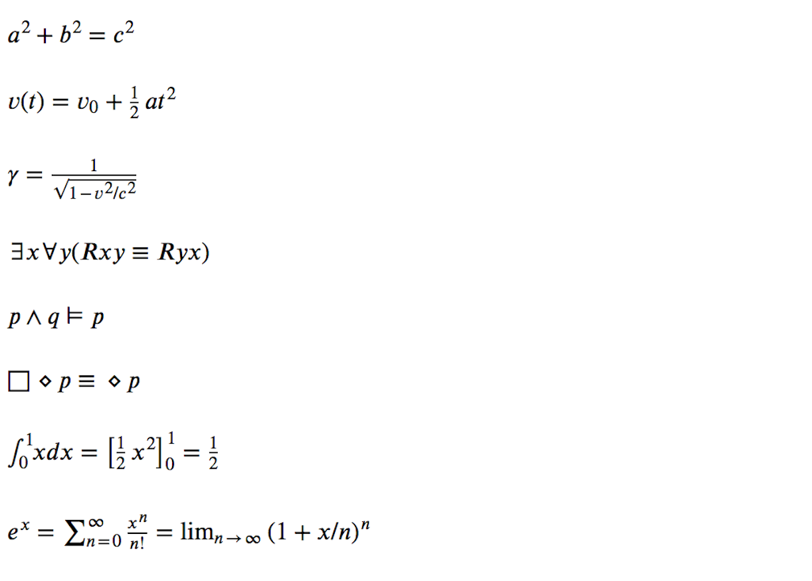
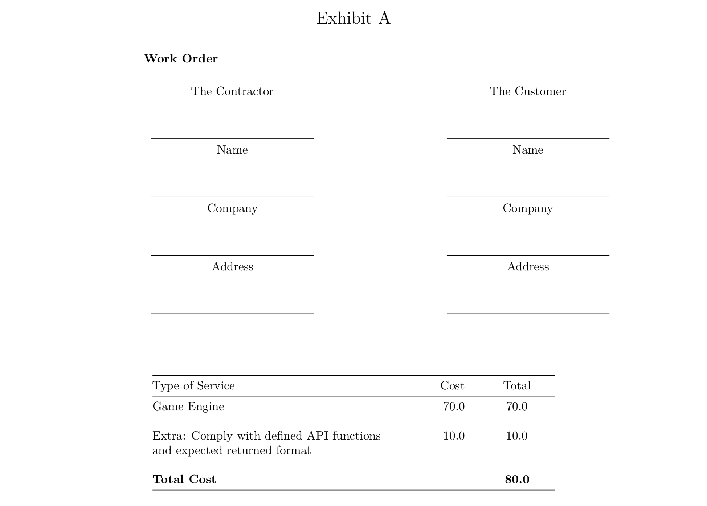
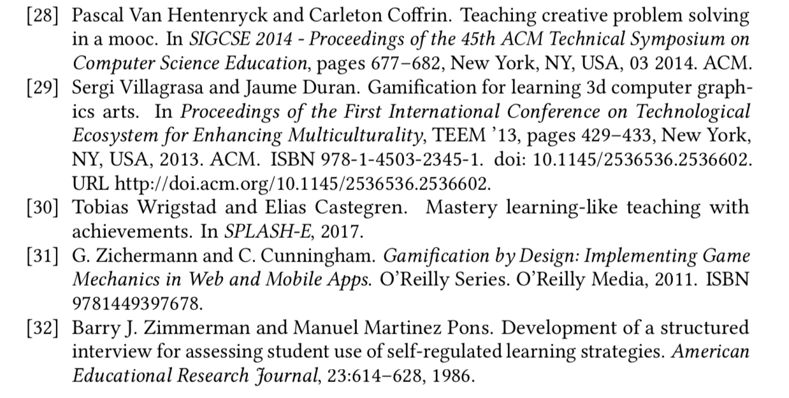
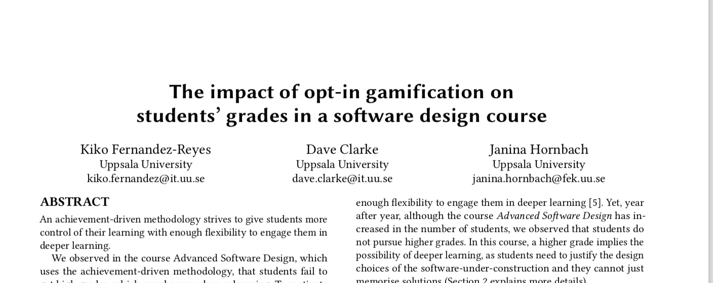

---

https://linux.cn/article-10228-1.html
https://linux.cn/article-10179-1.html

比如生成ppt


## 在命令行使用 Pandoc 进行文件转换

> 作者： [Kiko Fernandez-reyes](https://opensource.com/article/18/9/intro-pandoc) 
>
> 译者： [LCTT](https://linux.cn/lctt/) [jlztan](https://linux.cn/lctt/jlztan) 
>
> 转载自：<https://linux.cn/article-10228-1.html>

> 这篇指南介绍如何使用 Pandoc 将文档转换为多种不同的格式。


Pandoc 是一个命令行工具，用于将文件从一种标记语言转换为另一种标记语言。标记语言使用标签来标记文档的各个部分。常用的标记语言包括 Markdown、ReStructuredText、HTML、LaTex、ePub 和 Microsoft Word DOCX。

简单来说，[Pandoc](https://pandoc.org/) 允许你将一些文件从一种标记语言转换为另一种标记语言。典型的例子包括将 Markdown 文件转换为演示文稿、LaTeX，PDF 甚至是 ePub。

本文将解释如何使用 Pandoc 从单一标记语言（在本文中为 Markdown）生成多种格式的文档，引导你完成从 Pandoc 安装，到展示如何创建多种类型的文档，再到提供有关如何编写易于移植到其他格式的文档的提示。

文中还将解释使用元信息文件对文档内容和元信息（例如，作者姓名、使用的模板、书目样式等）进行分离的意义。

### Pandoc 安装和要求

Pandoc 默认安装在大多数 Linux 发行版中。本教程使用 pandoc-2.2.3.2 和 pandoc-citeproc-0.14.3。如果不打算生成 PDF，那么这两个包就足够了。但是，我建议也安装 texlive，这样就可以选择生成 PDF 了。

通过以下命令在 Linux 上安装这些程序：

```
sudo apt-get install pandoc pandoc-citeproc texlive
```

您可以在 Pandoc 的网站上找到其他平台的 [安装说明](http://pandoc.org/installing.html)。

我强烈建议安装 [pandoc-crossref](https://hackage.haskell.org/package/pandoc-crossref)，这是一个“用于对图表，方程式，表格和交叉引用进行编号的过滤器”。最简单的安装方式是下载 [预构建的可执行文件](https://github.com/lierdakil/pandoc-crossref/releases/tag/v0.3.2.1)，但也可以通过以下命令从 Haskell 的软件包管理器 cabal 安装它：

```
cabal update
cabal install pandoc-crossref
```

如果需要额外的 Haskell [安装信息](https://github.com/lierdakil/pandoc-crossref#installation)，请参考 pandoc-crossref 的 GitHub 仓库。

### 几个例子

我将通过解释如何生成三种类型的文档来演示 Pandoc 的工作原理：

- 由包含数学公式的 LaTeX 文件创建的网页
- 由 Markdown 文件生成的 Reveal.js 幻灯片
- 混合 Markdown 和 LaTeX 的合同文件

#### 创建一个包含数学公式的网站

Pandoc 的优势之一是以不同的输出文件格式显示数学公式。例如，我们可以从包含一些数学符号（用 LaTeX 编写）的 LaTeX 文档（名为 `math.tex`）生成一个网页。

`math.tex` 文档如下所示：

```
% Pandoc math demos
$a^2 + b^2 = c^2$
$v(t) = v_0 + \frac{1}{2}at^2$
$\gamma = \frac{1}{\sqrt{1 - v^2/c^2}}$
$\exists x \forall y (Rxy \equiv Ryx)$
$p \wedge q \models p$
$\Box\diamond p\equiv\diamond p$
$\int_{0}^{1} x dx = \left[ \frac{1}{2}x^2 \right]_{0}^{1} = \frac{1}{2}$
$e^x = \sum_{n=0}^\infty \frac{x^n}{n!} = \lim_{n\rightarrow\infty} (1+x/n)^n$
```

通过输入以下命令将 LaTeX 文档转换为名为 `mathMathML.html` 的网站：

```
pandoc math.tex -s --mathml  -o mathMathML.html
```

参数 `-s` 告诉 Pandoc 生成一个独立的网页（而不是网页片段，因此它将包括 HTML 中的 head 和 body 标签），`-mathml` 参数强制 Pandoc 将 LaTeX 中的数学公式转换成 MathML，从而可以由现代浏览器进行渲染。



看一下 [网页效果](http://pandoc.org/demo/mathMathML.html) 和 [代码](https://github.com/kikofernandez/pandoc-examples/tree/master/math)，代码仓库中的 Makefile 使得运行更加简单。

#### 制作一个 Reveal.js 幻灯片

使用 Pandoc 从 Markdown 文件生成简单的演示文稿很容易。幻灯片包含顶级幻灯片和下面的嵌套幻灯片。可以通过键盘控制演示文稿，从一个顶级幻灯片跳转到下一个顶级幻灯片，或者显示顶级幻灯片下面的嵌套幻灯片。 这种结构在基于 HTML 的演示文稿框架中很常见。

创建一个名为 `SLIDES` 的幻灯片文档（参见 [代码仓库](https://github.com/kikofernandez/pandoc-examples/tree/master/slides)）。首先，在 `％` 后面添加幻灯片的元信息（例如，标题、作者和日期）：

```
% Case Study
% Kiko Fernandez Reyes
% Sept 27, 2017
```

这些元信息同时也创建了第一张幻灯片。要添加更多幻灯片，使用 Markdown 的一级标题（在下面例子中的第5行，参考 [Markdown 的一级标题](https://daringfireball.net/projects/markdown/syntax#header) ）生成顶级幻灯片。

例如，可以通过以下命令创建一个标题为 “Case Study”、顶级幻灯片名为 “Wine Management System” 的演示文稿：

```
% Case Study
% Kiko Fernandez Reyes
% Sept 27, 2017
# Wine Management System
```

使用 Markdown 的二级标题将内容（比如包含一个新管理系统的说明和实现的幻灯片）放入刚刚创建的顶级幻灯片。下面添加另外两张幻灯片（在下面例子中的第 7 行和 14 行 ，参考 [Markdown 的二级标题](https://daringfireball.net/projects/markdown/syntax#header) ）。

- 第一个二级幻灯片的标题为 “Idea”，并显示瑞士国旗的图像
- 第二个二级幻灯片的标题为 “Implementation”

```
% Case Study% Kiko Fernandez Reyes% Sept 27, 2017# Wine Management System##  Idea## Implementation
```

我们现在有一个顶级幻灯片（`＃Wine Management System`），其中包含两张幻灯片（`## Idea` 和 `## Implementation`）。

通过创建一个由符号 `>` 开头的 Markdown 列表，在这两张幻灯片中添加一些内容。在上面代码的基础上，在第一张幻灯片中添加两个项目（第 9-10 行），第二张幻灯片中添加五个项目（第 16-20 行）：

```
% Case Study
% Kiko Fernandez Reyes
% Sept 27, 2017
# Wine Management System
##  Idea
## Implementationxxxxxxxxxx % Case Study% Kiko Fernandez Reyes% Sept 27, 2017# Wine Management System##  Idea## Implementation% Case Study% Kiko Fernandez Reyes% Sept 27, 2017# Wine Management System##  Idea>- Swiss love their **wine** and cheese>- Create a *simple* wine tracker system## Implementation>- Bottles have a RFID tag>- RFID reader (emits and read signal)>- **Raspberry Pi**>- **Server (online shop)**>- Mobile app
```

上面的代码添加了马特洪峰的图像，也可以使用纯 Markdown 语法或添加 HTML 标签来改进幻灯片。

要生成幻灯片，Pandoc 需要引用 Reveal.js 库，因此它必须与 `SLIDES` 文件位于同一文件夹中。生成幻灯片的命令如下所示：

```
pandoc -t revealjs -s --self-contained SLIDES \
-V theme=white -V slideNumber=true -o index.html
```


上面的 Pandoc 命令使用了以下参数：

- `-t revealjs` 表示将输出一个 revealjs 演示文稿

- `-s` 告诉 Pandoc 生成一个独立的文档

- `--self-contained` 生成没有外部依赖关系的 HTML 文件

- `-V`  设置以下变量：
  - `theme=white` 将幻灯片的主题设为白色
  - `slideNumber=true` 显示幻灯片编号

- `-o index.html` 在名为 `index.html` 的文件中生成幻灯片

为了简化操作并避免键入如此长的命令，创建以下 Makefile：

```
all: generate
generate:
    pandoc -t revealjs -s --self-contained SLIDES \
    -V theme=white -V slideNumber=true -o index.html
clean: index.html
    rm index.html
.PHONY: all clean generate
```

可以在 [这个仓库](https://github.com/kikofernandez/pandoc-examples/tree/master/slides) 中找到所有代码。

#### 制作一份多种格式的合同

假设你正在准备一份文件，并且（这样的情况现在很常见）有些人想用 Microsoft Word 格式，其他人使用自由软件，想要 ODT 格式，而另外一些人则需要 PDF。你不必使用 OpenOffice 或 LibreOffice 来生成 DOCX 或 PDF 格式的文件，可以用 Markdown 创建一份文档（如果需要高级格式，可以使用一些 LaTeX 语法），并生成任何这些文件类型。

和以前一样，首先声明文档的元信息（标题、作者和日期）：

```
% Contract Agreement for Software X
% Kiko Fernandez-Reyes
% August 28th, 2018
```

然后在 Markdown 中编写文档（如果需要高级格式，则添加 LaTeX）。例如，创建一个固定间隔的表格（在 LaTeX 中用 `\hspace{3cm}` 声明）以及客户端和承包商应填写的行（在 LaTeX 中用 `\hrulefill` 声明）。之后，添加一个用 Markdown 编写的表格。

创建的文档如下所示：



创建此文档的代码如下：

```
% Contract Agreement for Software X
% Kiko Fernandez-Reyes
% August 28th, 2018
...
### Work Order
\begin{table}[h]
\begin{tabular}{ccc}
The Contractor & \hspace{3cm} & The Customer \\
& & \\
& & \\
\hrulefill & \hspace{3cm} & \hrulefill \\
%
Name & \hspace{3cm} & Name \\
& & \\
& & \\
\hrulefill & \hspace{3cm} & \hrulefill \\
...
\end{tabular}
\end{table}
\vspace{1cm}
+--------------------------------------------|----------|-------------+
| Type of Service                            | Cost     |     Total   |
+:===========================================+=========:+:===========:+
| Game Engine                                | 70.0     | 70.0        |
|                                            |          |             |
+--------------------------------------------|----------|-------------+
|                                            |          |             |
+--------------------------------------------|----------|-------------+
| Extra: Comply with defined API functions   | 10.0     | 10.0        |
|        and expected returned format        |          |             |
+--------------------------------------------|----------|-------------+
|                                            |          |             |
+--------------------------------------------|----------|-------------+
| **Total Cost**                             |          | **80.0**    |
+--------------------------------------------|----------|-------------+
```

要生成此文档所需的三种不同输出格式，编写如下的 Makefile：

```
DOCS=contract-agreement.md
all: $(DOCS)
    pandoc -s $(DOCS) -o $(DOCS:md=pdf)
    pandoc -s $(DOCS) -o $(DOCS:md=docx)
    pandoc -s $(DOCS) -o $(DOCS:md=odt)
clean:
    rm *.pdf *.docx *.odt
.PHONY: all clean
```

4 到 7 行是生成三种不同输出格式的具体命令：

如果有多个 Markdown 文件并想将它们合并到一个文档中，需要按照希望它们出现的顺序编写命令。例如，在撰写本文时，我创建了三个文档：一个介绍文档、三个示例和一些高级用法。以下命令告诉 Pandoc 按指定的顺序将这些文件合并在一起，并生成一个名为 document.pdf 的 PDF 文件。

```
pandoc -s introduction.md examples.md advanced-uses.md -o document.pdf
```

### 模板和元信息

编写复杂的文档并非易事，你需要遵循一系列独立于内容的规则，例如使用特定的模板、编写摘要、嵌入特定字体，甚至可能要声明关键字。所有这些都与内容无关：简单地说，它就是元信息。

Pandoc 使用模板生成不同的输出格式。例如，有一个 LaTeX 的模板，还有一个 ePub 的模板，等等。这些模板的元信息中有未赋值的变量。使用以下命令找出 Pandoc 模板中可用的元信息：

```
pandoc -D FORMAT
```

例如，LaTex 的模版是：

```
pandoc -D latex
```

按照以下格式输出：

```
$if(title)$
\title{$title$$if(thanks)$\thanks{$thanks$}$endif$}
$endif$
$if(subtitle)$
\providecommand{\subtitle}[1]{}
\subtitle{$subtitle$}
$endif$
$if(author)$
\author{$for(author)$$author$$sep$ \and $endfor$}
$endif$
$if(institute)$
\providecommand{\institute}[1]{}
\institute{$for(institute)$$institute$$sep$ \and $endfor$}
$endif$
\date{$date$}
$if(beamer)$
$if(titlegraphic)$
\titlegraphic{\includegraphics{$titlegraphic$}}
$endif$
$if(logo)$
\logo{\includegraphics{$logo$}}
$endif$
$endif$
\begin{document}
```

如你所见，输出的内容中有标题、致谢、作者、副标题和机构模板变量（还有许多其他可用的变量）。可以使用 YAML 元区块轻松设置这些内容。 在下面例子的第 1-5 行中，我们声明了一个 YAML 元区块并设置了一些变量（使用上面合同协议的例子）：

```
---
title: Contract Agreement for Software X
author: Kiko Fernandez-Reyes
date: August 28th, 2018
---
(continue writing document as in the previous example)
```

这样做非常奏效，相当于以前的代码：

```
% Contract Agreement for Software X
% Kiko Fernandez-Reyes
% August 28th, 2018
```

然而，这样做将元信息与内容联系起来，也即 Pandoc 将始终使用此信息以新格式输出文件。如果你将要生成多种文件格式，最好要小心一点。例如，如果你需要以 ePub 和 HTML 的格式生成合同，并且 ePub 和 HTML 需要不同的样式规则，该怎么办？

考虑一下这些情况：

- 如果你只是尝试嵌入 YAML 变量 `css:style-epub.css`，那么将从 HTML 版本中移除该变量。这不起作用。
- 复制文档显然也不是一个好的解决方案，因为一个版本的更改不会与另一个版本同步。
- 你也可以像下面这样将变量添加到 Pandoc 命令中：

```
pandoc -s -V css=style-epub.css document.md document.epubpandoc -s -V css=style-html.css document.md document.html
```

我的观点是，这样做很容易从命令行忽略这些变量，特别是当你需要设置数十个变量时（这可能出现在编写复杂文档的情况中）。现在，如果将它们放在同一文件中（`meta.yaml` 文件），则只需更新或创建新的元信息文件即可生成所需的输出格式。然后你会编写这样的命令：

```
pandoc -s -V css=style-epub.css document.md document.epub
pandoc -s -V css=style-html.css document.md document.html
```

这是一个更简洁的版本，你可以从单个文件更新所有元信息，而无需更新文档的内容。

### 结语

通过以上的基本示例，我展示了 Pandoc 在将 Markdown 文档转换为其他格式方面是多么出色。


---


## 用 Pandoc 生成一篇调研论文

> 作者： [Kiko Fernandez-reyes](https://opensource.com/article/18/9/pandoc-research-paper)
>
> 译者： [LCTT](https://linux.cn/lctt/) [dianbanjiu](https://linux.cn/lctt/dianbanjiu)
>
> 转载自：<https://linux.cn/article-10179-1.html>

> 学习如何用 Markdown 管理章节引用、图像、表格以及更多。

这篇文章对于使用 [Markdown](https://en.wikipedia.org/wiki/Markdown) 语法做一篇调研论文进行了一个深度体验。覆盖了如何创建和引用章节、图像（用 Markdown 和 [LaTeX](https://www.latex-project.org/)）和参考书目。我们也讨论了一些棘手的案例和为什么使用 LaTex 是一个正确的做法。

### 调研

调研论文一般包括对章节、图像、表格和参考书目的引用。[Pandoc](https://pandoc.org/) 本身并不能交叉引用这些，但是它能够利用 [pandoc-crossref](http://lierdakil.github.io/pandoc-crossref/) 过滤器来完成自动编号和章节、图像、表格的交叉引用。

让我们从重写原本以 LaTax 撰写的 [一个教育调研报告的例子](https://dl.acm.org/citation.cfm?id=3270118) 开始，然后用 Markdown（和一些 LaTax）、Pandoc 和 Pandoc-crossref 重写。

#### 添加并引用章节

要想章节被自动编号，必须使用 Markdown H1 标题编写。子章节使用 H2-H4 子标题编写（通常不需要更多级别了）。例如一个章节的标题是 “Implementation”，写作 `# Implementation {#sec: implementation}`，然后 Pandoc 会把它转化为 `3. Implementation`（或者转换为相应的章节编号）。`Implementation` 这个标题使用了 H1 并且声明了一个 `{#sec: implementation}` 的标签，这是作者用于引用该章节的标签。要想引用一个章节，输入 `@` 符号并跟上对应章节标签，使用方括号括起来即可： `[@ sec:implementation]`

[在这篇论文中](https://dl.acm.org/citation.cfm?id=3270118), 我们发现了下面这个例子：

```
we lack experience (consistency between TAs, [@sec:implementation]).
```

Pandoc 转换：

```
we lack experience (consistency between TAs, Section 4).
```

章节被自动编号（这在本文最后的 `Makefile` 当中说明）。要创建无编号的章节，输入章节的标题并在最后添加 `{-}`。例如：`### Designing a game for maintainability {-}` 就以标题 “Designing a game for maintainability”，创建了一个无标号的章节。

#### 添加并引用图像

添加并引用一个图像，跟添加并引用一个章节和添加一个 Markdown 图片很相似：

```
{#fig:scatter-matrix}
```

上面这一行是告诉 Pandoc，有一个标有 Scatterplot matrix 的图像以及这张图片路径是 `data/scatterplots/RScatterplotMatrix2.png`。`{#fig:scatter-matrix}` 表明了用于引用该图像的名字。

这里是从一篇论文中进行图像引用的例子：

```
The boxes "Enjoy", "Grade" and "Motivation" ([@fig:scatter-matrix]) ...
```

Pandoc 产生如下输出：

```
The boxes "Enjoy", "Grade" and "Motivation" (Fig. 1) ...
```

#### 添加及引用参考书目

大多数调研报告都把引用放在一个 BibTeX 的数据库文件中。在这个例子中，该文件被命名为 [biblio.bib](https://github.com/kikofernandez/pandoc-examples/blob/master/research-paper/biblio.bib)，它包含了论文中所有的引用。下面是这个文件的样子：

```
@inproceedings{wrigstad2017mastery,
    Author =       {Wrigstad, Tobias and Castegren, Elias},
    Booktitle =    {SPLASH-E},
    Title =        {Mastery Learning-Like Teaching with Achievements},
    Year =         2017
}
@inproceedings{review-gamification-framework,
  Author =       {A. Mora and D. Riera and C. Gonzalez and J. Arnedo-Moreno},
  Publisher =    {IEEE},
  Booktitle =    {2015 7th International Conference on Games and Virtual Worlds
                  for Serious Applications (VS-Games)},
  Doi =          {10.1109/VS-GAMES.2015.7295760},
  Keywords =     {formal specification;serious games (computing);design
                  framework;formal design process;game components;game design
                  elements;gamification design frameworks;gamification-based
                  solutions;Bibliographies;Context;Design
                  methodology;Ethics;Games;Proposals},
  Month =        {Sept},
  Pages =        {1-8},
  Title =        {A Literature Review of Gamification Design Frameworks},
  Year =         2015,
  Bdsk-Url-1 =   {http://dx.doi.org/10.1109/VS-GAMES.2015.7295760}
}
...
```

第一行的 `@inproceedings{wrigstad2017mastery,` 表明了出版物 的类型（`inproceedings`），以及用来指向那篇论文的标签（`wrigstad2017mastery`）。

引用这篇题为 “Mastery Learning-Like Teaching with Achievements” 的论文, 输入：

```
the achievement-driven learning methodology [@wrigstad2017mastery]
```

Pandoc 将会输出：

```
the achievement- driven learning methodology [30]
```

这篇论文将会产生像下面这样被标号的参考书目：



引用文章的集合也很容易：只要引用使用分号 `;` 分隔开被标记的参考文献就可以了。如果一个引用有两个标签 —— 例如： `SEABORN201514` 和 `gamification-leaderboard-benefits`—— 像下面这样把它们放在一起引用：

```
Thus, the most important benefit is its potential to increase students' motivation
and engagement [@SEABORN201514;@gamification-leaderboard-benefits].
```

Pandoc 将会产生：

```
Thus, the most important benefit is its potential to increase students’ motivation
and engagement [26, 28]
```

### 问题案例

一个常见的问题是所需项目与页面不匹配。不匹配的部分会自动移动到它们认为合适的地方，即便这些位置并不是读者期望看到的位置。因此在图像或者表格接近于它们被提及的地方时，我们需要调节一下那些元素放置的位置，使得它们更加易于阅读。为了达到这个效果，我建议使用 `figure` 这个 LaTeX 环境参数，它可以让用户控制图像的位置。

我们看一个上面提到的图像的例子：

```
{#fig:scatter-matrix}
```

然后使用 LaTeX 重写：

```
\begin{figure}[t]
\includegraphics{data/scatterplots/RScatterplotMatrix2.png}
\caption{\label{fig:matrix}Scatterplot matrix}
\end{figure}
```

在 LaTeX 中，`figure` 环境参数中的 `[t]` 选项表示这张图用该位于该页的最顶部。有关更多选项，参阅 [LaTex/Floats, Figures, and Captions](https://en.wikibooks.org/wiki/LaTeX/Floats,_Figures_and_Captions#Figures) 这篇 Wikibooks 的文章。

### 产生一篇论文

到目前为止，我们讲了如何添加和引用（子）章节、图像和参考书目，现在让我们重温一下如何生成一篇 PDF 格式的论文。要生成 PDF，我们将使用 Pandoc 生成一篇可以被构建成最终 PDF 的 LaTeX 文件。我们还会讨论如何以 LaTeX，使用一套自定义的模板和元信息文件生成一篇调研论文，以及如何将 LaTeX 文档编译为最终的 PDF 格式。

很多会议都提供了一个 .cls 文件或者一套论文应有样式的模板；例如，它们是否应该使用两列的格式以及其它的设计风格。在我们的例子中，会议提供了一个名为 `acmart.cls` 的文件。

作者通常想要在他们的论文中包含他们所属的机构，然而，这个选项并没有包含在默认的 Pandoc 的 LaTeX 模板（注意，可以通过输入 `pandoc -D latex` 来查看 Pandoc 模板）当中。要包含这个内容，找一个 Pandoc 默认的 LaTeX 模板，并添加一些新的内容。将这个模板像下面这样复制进一个名为 `mytemplate.tex` 的文件中：

```
pandoc -D latex > mytemplate.tex
```

默认的模板包含以下代码：

```
$if(author)$
\author{$for(author)$$author$$sep$ \and $endfor$}
$endif$
$if(institute)$
\providecommand{\institute}[1]{}
\institute{$for(institute)$$institute$$sep$ \and $endfor$}
$endif$
```

因为这个模板应该包含作者的联系方式和电子邮件地址，在其他一些选项之间，我们更新这个模板以添加以下内容（我们还做了一些其他的更改，但是因为文件的长度，就没有包含在此处）：

```
latex
$for(author)$
    $if(author.name)$
        \author{$author.name$}
        $if(author.affiliation)$
            \affiliation{\institution{$author.affiliation$}}
        $endif$
        $if(author.email)$
            \email{$author.email$}
        $endif$
    $else$
        $author$
    $endif$
$endfor$
```

要让这些更改起作用，我们还应该有下面的文件：

- `main.md` 包含调研论文
- `biblio.bib` 包含参考书目数据库
- `acmart.cls` 我们使用的文档的集合
- `mytemplate.tex` 是我们使用的模板文件（代替默认的）

让我们添加论文的元信息到一个 `meta.yaml` 文件：

```
---
template: 'mytemplate.tex'
documentclass: acmart
classoption: sigconf
title: The impact of opt-in gamification on `\\`{=latex} students' grades in a software design course
author:
- name: Kiko Fernandez-Reyes
  affiliation: Uppsala University
  email: kiko.fernandez@it.uu.se
- name: Dave Clarke
  affiliation: Uppsala University
  email: dave.clarke@it.uu.se
- name: Janina Hornbach
  affiliation: Uppsala University
  email: janina.hornbach@fek.uu.se
bibliography: biblio.bib
abstract: |
  An achievement-driven methodology strives to give students more control over their learning with enough flexibility to engage them in deeper learning. (more stuff continues)
include-before: |
      \` ``{=latex}
      \copyrightyear{2018}
      \acmYear{2018}
      \setcopyright{acmlicensed}
      \acmConference[MODELS '18 Companion]{ACM/IEEE 21th International Conference on Model Driven Engineering Languages and Systems}{October 14--19, 2018}{Copenhagen, Denmark}
      \acmBooktitle{ACM/IEEE 21th International Conference on Model Driven Engineering Languages and Systems (MODELS '18 Companion), October 14--19, 2018, Copenhagen, Denmark}
      \acmPrice{XX.XX}
      \acmDOI{10.1145/3270112.3270118}
      \acmISBN{978-1-4503-5965-8/18/10}
      \begin{CCSXML}
      <ccs2012>
      <concept>
      <concept_id>10010405.10010489</concept_id>
      <concept_desc>Applied computing~Education</concept_desc>
      <concept_significance>500</concept_significance>
      </concept>
      </ccs2012>
      \end{CCSXML}
      \ccsdesc[500]{Applied computing~Education}
      \keywords{gamification, education, software design, UML}
      \` ``
figPrefix:
  - "Fig."
  - "Figs."
secPrefix:
  - "Section"
  - "Sections"
...

```

这个元信息文件使用 LaTeX 设置下列参数：

- `template` 指向使用的模板（`mytemplate.tex`）
- `documentclass` 指向使用的 LaTeX 文档集合（`acmart`）
- `classoption` 是在 `sigconf` 的案例中，指向这个类的选项
- `title` 指定论文的标题
- `author` 是一个包含例如 `name`、`affiliation` 和 `email` 的地方
- `bibliography` 指向包含参考书目的文件（`biblio.bib`）
- `abstract` 包含论文的摘要
- `include-before` 是这篇论文的具体内容之前应该被包含的信息；在 LaTeX 中被称为 [前言](https://www.sharelatex.com/learn/latex/Creating_a_document_in_LaTeX#The_preamble_of_a_document)。我在这里包含它去展示如何产生一篇计算机科学的论文，但是你可以选择跳过
- `figPrefix` 指向如何引用文档中的图像，例如：当引用图像的 `[@fig:scatter-matrix]` 时应该显示什么。例如，当前的 `figPrefix` 在这个例子 `The boxes "Enjoy", "Grade" and "Motivation" ([@fig:scatter-matrix])`中，产生了这样的输出：`The boxes "Enjoy", "Grade" and "Motivation" (Fig. 3)`。如果这里有很多图像，目前的设置表明它应该在图像号码旁边显示 `Figs.`
- `secPrefix` 指定如何引用文档中其他地方提到的部分（类似之前的图像和概览）

现在已经设置好了元信息，让我们来创建一个 `Makefile`，它会产生你想要的输出。`Makefile` 使用 Pandoc 产生 LaTeX 文件，`pandoc-crossref` 产生交叉引用，`pdflatex` 构建 LaTeX 为 PDF，`bibtex` 处理引用。

`Makefile` 已经展示如下：

```
all: paper
paper:
        @pandoc -s -F pandoc-crossref --natbib meta.yaml --template=mytemplate.tex -N \
         -f markdown -t latex+raw_tex+tex_math_dollars+citations -o main.tex main.md
        @pdflatex main.tex &> /dev/null
        @bibtex main &> /dev/null
        @pdflatex main.tex &> /dev/null
        @pdflatex main.tex &> /dev/null
clean:
        rm main.aux main.tex main.log main.bbl main.blg main.out
.PHONY: all clean paper
```

Pandoc 使用下面的标记：

- `-s` 创建一个独立的 LaTeX 文档
- `-F pandoc-crossref` 利用 `pandoc-crossref` 进行过滤
- `--natbib` 用 `natbib` （你也可以选择 `--biblatex`）对参考书目进行渲染
- `--template` 设置使用的模板文件
- `-N` 为章节的标题编号
- `-f` 和 `-t` 指定从哪个格式转换到哪个格式。`-t` 通常包含格式和 Pandoc 使用的扩展。在这个例子中，我们标明的 `raw_tex+tex_math_dollars+citations` 允许在 Markdown 中使用 `raw_tex` LaTeX。 `tex_math_dollars` 让我们能够像在 LaTeX 中一样输入数学符号，`citations` 让我们可以使用 [这个扩展](http://pandoc.org/MANUAL.html#citations)。

要从 LaTeX 产生 PDF，按 [来自bibtex](http://www.bibtex.org/Using/) 的指导处理参考书目：

```
@pdflatex main.tex &> /dev/null
@bibtex main &> /dev/null
@pdflatex main.tex &> /dev/null
@pdflatex main.tex &> /dev/null

```

脚本用 `@` 忽略输出，并且重定向标准输出和错误到 `/dev/null` ，因此我们在使用这些命令的可执行文件时不会看到任何的输出。

最终的结果展示如下。这篇文章的库可以在 [GitHub](https://github.com/kikofernandez/pandoc-examples/tree/master/research-paper) 找到：



### 结论

在我看来，研究的重点是协作、思想的传播，以及在任何一个恰好存在的领域中改进现有的技术。许多计算机科学家和工程师使用 LaTeX 文档系统来写论文，它对数学提供了完美的支持。来自社会科学的研究人员似乎更喜欢 DOCX 文档。

当身处不同社区的研究人员一同写一篇论文时，他们首先应该讨论一下他们将要使用哪种格式。然而如果包含太多的数学符号，DOCX 对于工程师来说不会是最简便的选择，LaTeX 对于缺乏编程经验的研究人员来说也有一些问题。就像这篇文章中展示的，Markdown 是一门工程师和社会科学家都很轻易能够使用的语言。

```

```